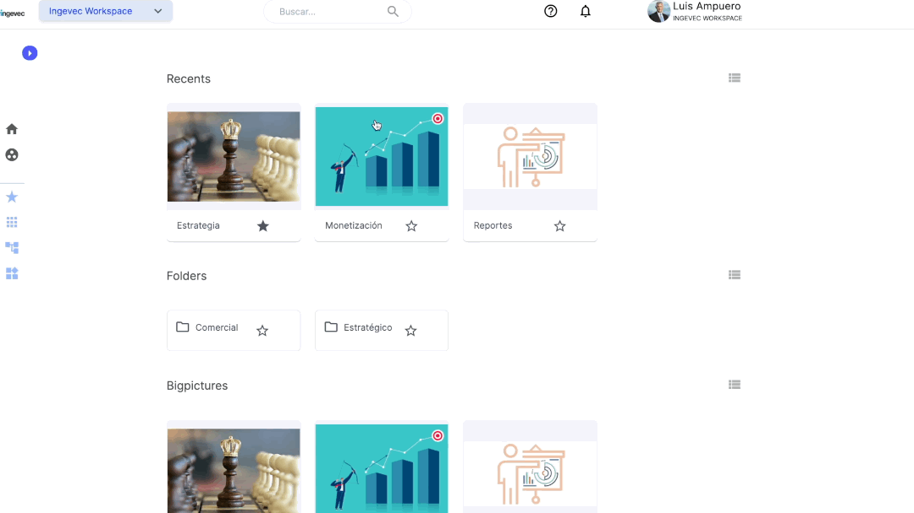
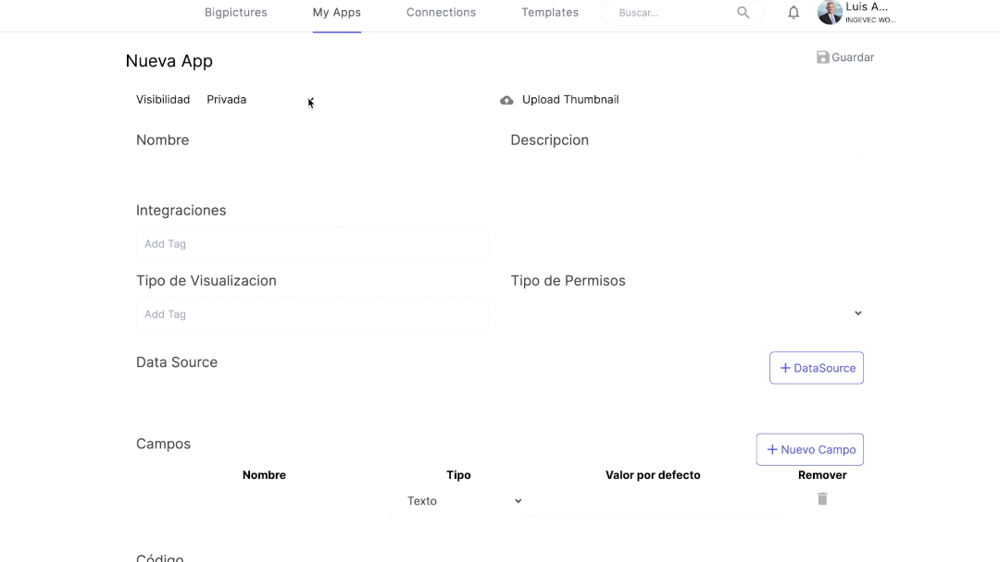
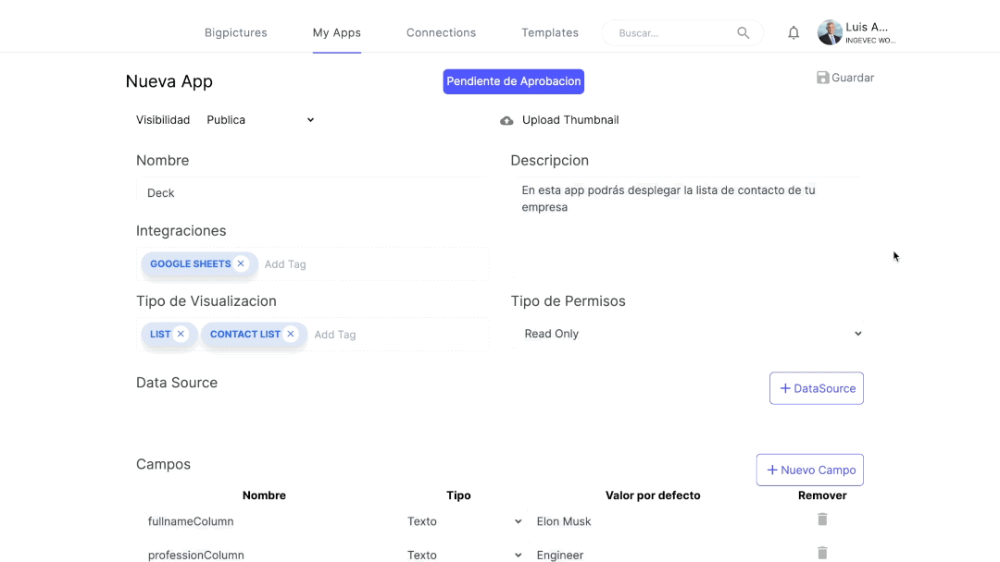
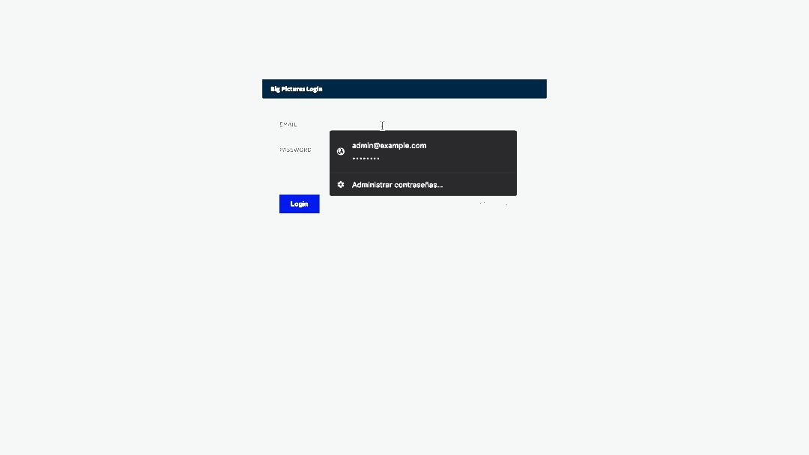
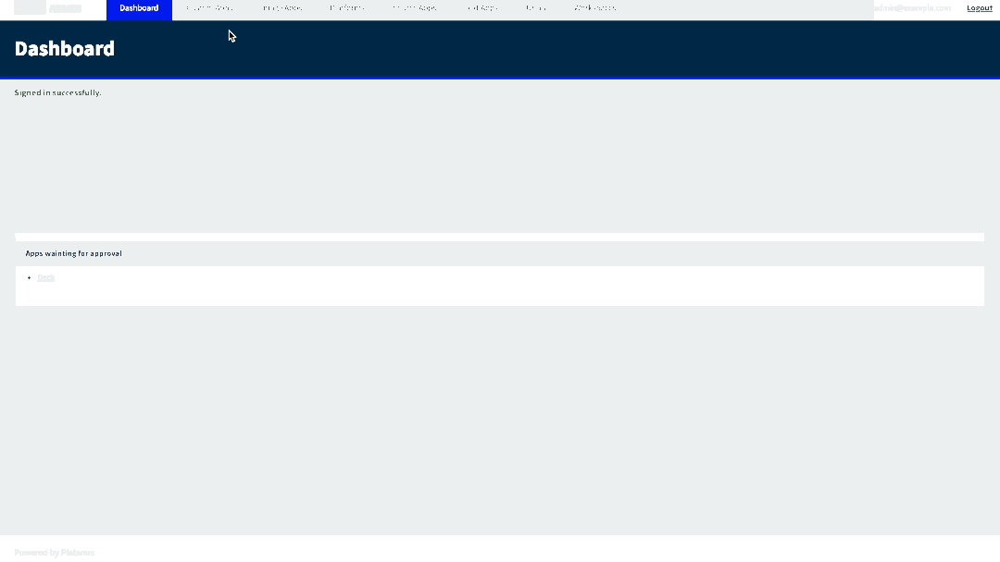
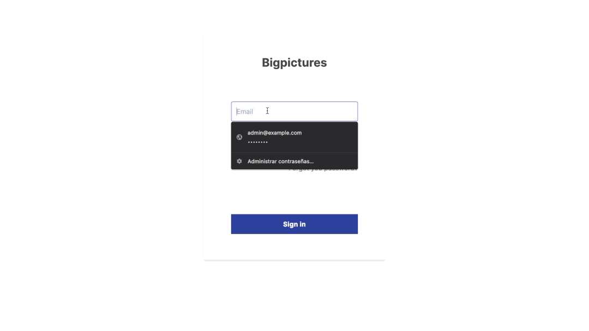

# Agregar la App Deck a la lista de Apps del Canvas en ambiente local

A continuación, se detallan los pasos para poder incorporar la app de directorio a nuestra lista de aplicaciones de **Visualización De Datos**:

## Crear la App Deck como DEV

1. Logueado como usuario con role DEV, dirígete a **My Apps** en el menú lateral izquierdo. Luego, da click en **New App** para crear una nueva app.

2. Completa los campos iniciales:
- Visibilidad: selecciona ✏️**Pública** para que la app se pueda usar en todos los workspaces y aparezca en la lista de apps del Canvas.
- Nombre: por ahora es necesario que se llame ✏️**Deck**.
- Descripción: describe lo que hace la app, ie: ✏️**En esta app podrás desplegar la lista de contactos de tu empresa**.
- Integraciones: origen del Datasource que consume la app, ie: **Microsoft 365**, ✏️**Google Sheets**.
- Tipo de visualización: forma en la que la app muestra los datos, ie: **Chart**, **Table**, ✏️**List**, ✏️**Contact List**.
- Tipo de permisos: próximo a ser deprecado, usar ✏️**Read Only**.

3. Copia y pega los campos y los datos por defecto de la siguiente tabla en la sección Campos:

| **Campo**        | **Valor por defecto**                        |
|------------------|----------------------------------------------|
| fullnameColumn   | Elon Musk                                    |
| professionColumn | Engineer                                     |
| countryColumn    | United States                                |
| birthdayColumn   | 28-06-1971                                   |
| emailColumn      | elon@tesla.co                                |
| phoneColumn      | +1 012 345-6789                              |
| profilePicColumn | https://static.toiimg.com/photo/76729750.cms |

***Nota***: los valores por defecto pueden variar pero los campos no.

4. Abre el archivo index.html de este repositorio, da click en **Raw**, copia todo y pégalo en la sección Código.

5. Sube al principio del form y da click en **Guardar**.

Una vez que se guarda, la app queda inmediatamente pendiente de aprobación. Para aprobarla y poder ver la app Deck en la lista de Apps en el Canvas de edición es necesario que un usuario superadmin la revise y de su visto bueno.

## Aprobar la App Deck como superadmin

6. Abre un perfil de incógnito en tu actual browser o abre un browser distinto. Haz login como superadmin en localhost:3000/admin/login (admin@example.com:password).

7. Dirígite a la pestaña **Custom Apps**, ahí verás la app que acabas de guardar. Da click en **Edit**, cambia el Visibility Status de **Pending(Public)** a ✏️**In Bigstore** y da click en **Guardar Custom App**. Luego, Puedes cerrar la ventana de incógnito o el otro browser.

## Variables de ambiente

Para el próximo paso, es necesario que verifiques que en el proyecto [big-pictures](https://github.com/BigPIcturesCo/big-pictures) que clonaste en tu máquina, estén las siguientes variables de ambiente en el archivo .env.development:

`
GOOGLE_CLIENT_SECRET=*
`

`
GOOGLE_CLIENT_ID=*
`

## Instanciar la App Deck en una vista como PLATFORM OWNER

8. Haz login como usuario con role PLATFORM OWNER y dirígete a **Configuración** en el menú lateral izquierdo. Luego, da click en la pestaña **Conexiones** y verifica que tengas una conexión con tu cuenta de Google asociada a ese usuario. Si no tienes conexiones, crea una nueva dando click en **New connection**.

9. Ve a una vista donde quieras agregar la app Deck y da click en **edit**. Haz drag&drop de la app Deck desde la lista de Apps en el menú lateral derecho y posiciónala donde mejor te parezca.

Para configurar la fuente de los datos que consumirá la app Deck debes tener un archivo en la Unidad de tu cuenta de Google asociada como [este](https://docs.google.com/spreadsheets/d/1PiBStiGB7eFiOurNI8c-n2dG7WL4PeLgAar0z5fA6PU/edit?usp=sharing). Los headers y filas pueden variar, lo importante es hacer bien el match entre los campos definidos en el paso 3 y los headers de tu archivo.

10. Finalmente, da click en los 3 puntos de la app Deck, después en **Configure** y completa los campos solicitados:
- Datasource: selecciona ✏️**Gsheet**.
- Archivo y página: escribe el nombre de tu archivo y el nombre de la hoja, ie: archivo: ✏️**Datos de Prueba Deck App**, hoja: ✏️**Sheet1**.
- Columns and Rows: escribe el rango de los datos a ser considerados, ie: From the cell ✏️**A1** to the cell ✏️**G13**.
- Datasource filename: escribe un nombre para el datasource, ie: ✏️**Datos Deck**.
- Match entre Campos definidos en paso 3 y el header de tu archivo: haz correctamente el match entre estos valores, ie: FullnameColumn &rarr; ✏️**Nombre completo**, ProfessionColumn &rarr; ✏️**Profesión**, CountryColumn &rarr; ✏️**País**, BirthdayColumn &rarr; ✏️**Fecha Nacimiento**, EmailColumn &rarr; ✏️**Correo electrónico**, PhoneColumn &rarr; ✏️**Número de contacto**, ProfilePicColumn &rarr; ✏️**Imagen de Perfil**.
Da click en **Guardar** y listo!

🎉 Felicidades! Has terminado de configurar la App de **Visualización De Datos** Deck en tu ambiente local.
